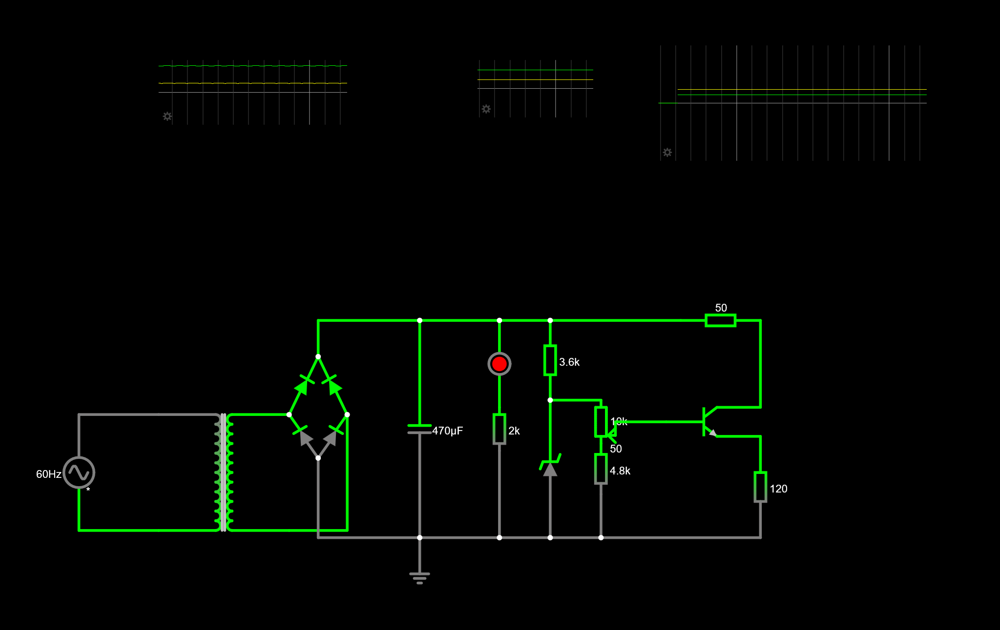
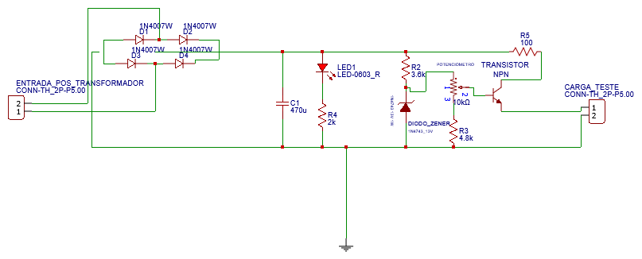
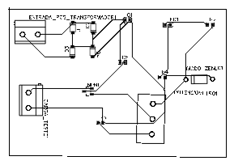

# Trabalho 1: Fonte de Tensão Ajustável — 3V a 12V / 100mA

## 👥 Integrantes
- Arthur Andrade Carneiro Almeida
- Guilherme Rodrigues de Oliveira
- Kawan da Silva Costa

## 📝 Descrição do Projeto
Projeto desenvolvido para a disciplina de Eletrônica para Computação, ministrada pelo Prof. Eduardo do Valle Simões (USP - São Carlos). 

O objetivo do circuito é implementar uma fonte de tensão em corrente contínua (DC) com saída ajustável entre **3V e 12V** e capacidade de fornecer até **100mA** de corrente à carga. O projeto utiliza uma ponte retificadora, filtragem capacitiva e regulação linear com Diodo Zener e Transistor para controle de corrente.

---

## 💻 Simulação no Falstad

O circuito foi inteiramente projetado e validado via simulador antes da montagem física.
🔗 **[Abrir no Falstad Circuit Simulator](https://www.falstad.com/s.php?s=SMkxUK)**

---

## 🛠️ Componentes e Custos

Abaixo estão listados os componentes exatos utilizados no projeto físico, com seus respectivos valores unitários e totais.

| Quantidade | Componente | Especificação | Valor Unitário | Valor Total |
| :---: | :--- | :--- | :--- | :--- |
| 1 | Potenciômetro | 1W B10K B-16, 5XE-20XR-7MM | R$ 7,00 | R$ 7,00 |
| 1 | Diodo Zener | 13V 1W (1N4743 SEMTECH) | R$ 0,50 | R$ 0,50 |
| 1 | Transistor NPN | BC337-40 N 50V 0,8A TO-92 | R$ 0,70 | R$ 0,70 |
| 1 | Capacitor Eletrolítico| 470uF x 50V | R$ 5,50 | R$ 5,50 |
| 10 | Resistor de Carvão | CR25 1K2 | R$ 0,07 | R$ 0,70 |
| 10 | Resistor de Carvão | CR25 100R | R$ 0,07 | R$ 0,70 |
| 10 | Diodo Retificador | 1N4007 (LGE= 1N4004) | R$ 0,20 | R$ 2,00 |
| 1 | LED 5mm Vermelho | DIFUSO 333-2 SDRD/S530-L | R$ 0,50 | R$ 0,50 |
| **Total** | | | | **R$ 17,60** |

---

## 📐 Cálculos do Circuito

### 1. Etapa de Filtragem (Capacitor)
Para garantir a estabilidade da fonte, o capacitor armazena energia durante os picos da onda retificada. Considerando uma frequência de rede retificada em onda completa de **120Hz** e uma corrente de carga máxima de **100mA**, o *ripple* (tensão de ondulação) máximo no capacitor de **470µF** é dado por:

$$V_{ripple} = \frac{I_{carga}}{f \cdot C}$$

$$V_{ripple} = \frac{0{,}1}{120 \cdot 470 \times 10^{-6}} \approx 1{,}77\text{ V}$$

Essa baixa ondulação garante que a tensão na entrada do regulador seja contínua o suficiente para manter o Diodo Zener polarizado corretamente.

### 2. Regulação com Zener e Transistor
A tensão máxima de base do transistor é fixada pelo Diodo Zener em **13V**. Como há uma queda de tensão intrínseca na junção base-emissor ($V_{BE}$) do transistor NPN (BC337), a tensão máxima teórica de saída ($V_{out}$) é:

$$V_{out(max)} = V_{Zener} - V_{BE}$$

$$V_{out(max)} = 13\text{ V} - 0{,}7\text{ V} = 12{,}3\text{ V}$$

Isso atende perfeitamente ao requisito de fornecer até **12V** na saída. O ajuste fino entre **3V e 12V** é feito através do divisor de tensão comandado pelo potenciômetro de **10kΩ**.

---

## Esquemático no EasyEDA

## PCB no EasyEDA

---

## Vídeo Funcionamento

  <video width="600" controls>
    <source src="./IMAGENS/explicando.mp4" type="video/mp4">
  </video>

---

